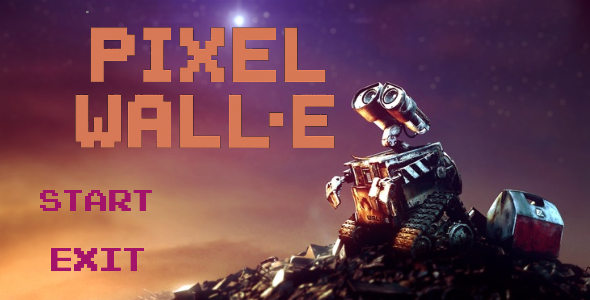
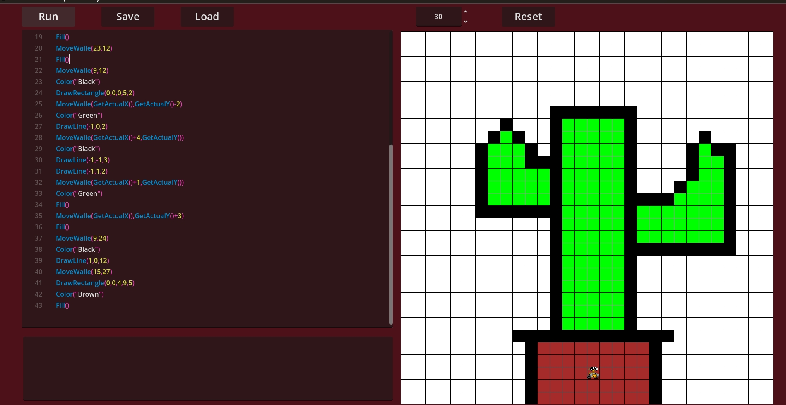
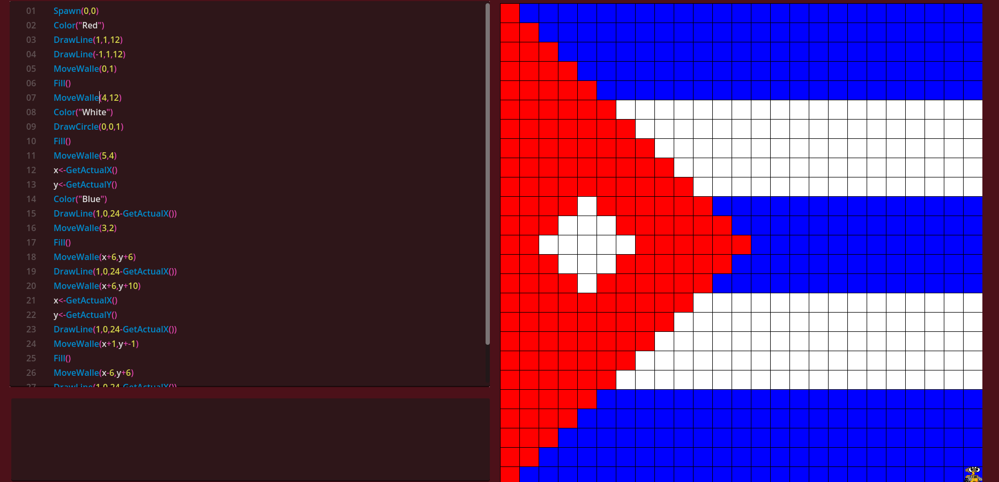
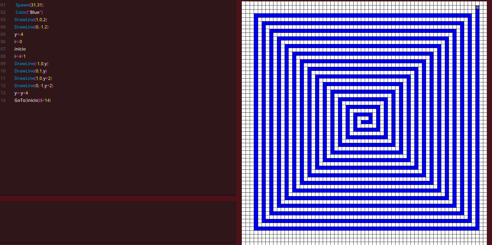

# 🟦🟩 Pixel-Wall-E 🎨🤖

## ✨ Introducción

**Pixel-Wall-E** es una aplicación interactiva desarrollada en **C#** como proyecto académico para la materia de Ciencias de la Computación.  
¡Ayuda a Wall-E, el simpático robot, a crear arte pixelado (pixel-art) siguiendo comandos de un lenguaje de programación personalizado! Los comandos permiten controlar a Wall-E para pintar píxeles sobre un canvas cuadrado, ejecutando instrucciones de dibujo y lógica.  

---

## 🖥️ ¿Cómo funciona el proyecto?

📝 La aplicación cuenta con un editor de texto donde puedes escribir código en el lenguaje de Wall-E y ejecutar los comandos para ver el resultado visualmente en el canvas.  
📂 Puedes importar archivos con extensión `.pw` o exportar el código actual del editor a un archivo para compartir tus creaciones.

---

## 🚀 Instalación y uso

1. **Descarga y ejecuta**
   - ⬇️ Clona este repositorio.
   - 📦 Ve a la carpeta `release/` y descomprime el archivo `.zip` que contiene el ejecutable (`PixelWallE.exe`).
   - 🖱️ ¡Haz doble clic en `PixelWallE.exe` y comienza a crear tu arte!

2. **Interfaz de usuario**
   - ▶️ **Run**: Para compilar el código y que Wall-E pinte en el canvas según tus instrucciones, escribe el código en el editor y presiona el botón **Run**.
   - 💾 **Save**: Para guardar tus códigos y creaciones, utiliza el botón **Save**. Esto exportará tu código a un archivo `.pw`.
   - 📂 **Load**: Para cargar archivos existentes en formato `.pw`, utiliza el botón **Load** y selecciona tu archivo.
   - 🧹 **Reset**: Para limpiar y reiniciar el canvas, presiona el botón **Reset**.
   - 📏 **Dimensión del canvas**: Puedes cambiar la dimensión del canvas desde 1 hasta 256 para adaptar el espacio de dibujo.

---

## 👾 Lenguaje de programación de Wall-E

El lenguaje consiste en **instrucciones**, **asignaciones**, **funciones**, **etiquetas** y **saltos condicionales**.  
Cada instrucción o comando debe ir en una línea separada. Aquí tienes un resumen:

### 1️⃣ Instrucciones principales

- 🟢 **Spawn(int x, int y)**  
  Inicializa a Wall-E en la posición `(x, y)` del canvas.  
  _Obligatorio como primer comando y solo puede aparecer una vez._

  Ejemplos:
  - `Spawn(0, 0)` → 🟩 Esquina superior izquierda.
  - `Spawn(50, 50)` → 🔲 Centro de un canvas 100x100.
  - `Spawn(255, 0)` → 🟥 Esquina superior derecha en un canvas 256x256.

- 🎨 **Color(string color)**  
  Cambia el color del pincel.  
  _Colores soportados:_  
  `"Red"`, `"Blue"`, `"Green"`, `"Yellow"`, `"Orange"`, `"Purple"`, `"Black"`, `"White"`, `"Transparent"`  
  - Por defecto: `"Transparent"` (no pinta).
  - `"White"` funciona como borrador.  
  - El canvas inicia blanco.

- 🖌️ **Size(int k)**  
  Cambia el grosor del pincel (en píxeles).  
  _Debe ser impar; si es par, se reduce al impar anterior. Por defecto es 1._

- ➖ **DrawLine(int dirX, int dirY, int distance)**  
  Dibuja una línea desde la posición actual en la dirección `(dirX, dirY)` y avanza `distance` píxeles.  
  _Wall-E termina en el último píxel dibujado._

  Direcciones posibles:
  - ↖️ `(-1,-1)` | ⬅️ `(-1,0)` | ↙️ `(-1,1)` | ⬇️ `(0,1)`  
  - ↘️ `(1,1)`  | ➡️ `(1,0)`  | ↗️ `(1,-1)` | ⬆️ `(0,-1)`

- 🟠 **DrawCircle(int dirX, int dirY, int radius)**  
  Dibuja una circunferencia de radio `radius` en la dirección dada.  
  _Wall-E se posiciona en el centro al finalizar._

- 🟦 **DrawRectangle(int dirX, int dirY, int distance, int width, int height)**  
  Dibuja un rectángulo centrado en la posición a la que Wall-E llega tras moverse `distance` en la dirección `(dirX, dirY)`.

- 🪣 **Fill()**  
  Rellena con el color actual todos los píxeles adyacentes del mismo color que el píxel actual (similar a la "cubeta" en programas de dibujo).

---

### 2️⃣ Variables y asignaciones

Permite asignar valores numéricos o booleanos a variables:

```text
nombre_variable <- Expresión
```

- Variables pueden contener letras, números y espacios, pero no iniciar con número ni espacio.
- Las expresiones pueden ser aritméticas o booleanas.

---

### 3️⃣ Expresiones

- ➕ **Aritméticas:**  
  Números enteros, variables numéricas, operaciones: `+`, `-`, `*`, `/`, `**`, `%`  
  _Ejemplo:_ `k <- 3 + 3 * 10`

- 🔃 **Booleanas:**  
  Operadores: `&&` (and), `||` (or), comparaciones: `==`, `>=`, `<=`, `>`, `<`  
  _Ejemplo:_ `flag <- (n > 0) && (k == 2)`

---

### 4️⃣ Funciones

- `GetActualX()` / `GetActualY()` → Posición actual de Wall-E.
- `GetCanvasSize()` → Tamaño del canvas.
- `GetColorCount(color, x1, y1, x2, y2)` → Cuenta píxeles de un color en una región.
- `IsBrushColor(color)` → Devuelve 1 si el color de la brocha coincide.
- `IsBrushSize(size)` → Devuelve 1 si el tamaño de la brocha coincide.
- `IsCanvasColor(color, vertical, horizontal)` → Devuelve 1 si el píxel relativo a Wall-E es del color dado.

---

### 5️⃣ Etiquetas y saltos condicionales

Las etiquetas marcan posiciones en el código y los saltos condicionales permiten ciclos y bifurcaciones:

- 🏷️ **Etiqueta:**  
  `nombre_etiqueta`
- 🔁 **Salto condicional:**  
  `GoTo [nombre_etiqueta] (condición)`

_Si la condición es verdadera, la ejecución salta a la etiqueta. Si la etiqueta no existe, es error de compilación._

---

## 📝 Ejemplo de código

```text
Spawn(0, 0)
Color(Black)
n <- 5
k <- 3 + 3 * 10
n <- k * 2
actual_x <- GetActualX()
i <- 0
loop1
DrawLine(1, 0, 1)
i <- i + 1
is_brush_color_blue <- IsBrushColor("Blue")
GoTo [loop_ends_here] (is_brush_color_blue == 1)
GoTo [loop1] (i < 10)
Color("Blue")
GoTo [loop1] (1 == 1)
loop_ends_here
```

**Explicación:**  
1️⃣ Wall-E inicia en la esquina superior izquierda.  
2️⃣ El pincel es negro.  
3️⃣ Se hacen asignaciones y operaciones aritméticas.  
4️⃣ Se declara una etiqueta para un ciclo (`loop1`).  
5️⃣ Se dibuja a la derecha y se incrementa un contador.  
6️⃣ Se verifica si la brocha es azul; si es así, se termina el ciclo, si no, continúa.  
7️⃣ Cuando termina el ciclo, se cambia el color a azul y se repite el ciclo.  
8️⃣ Cuando la brocha es azul, se salta a la etiqueta `loop_ends_here` y termina.

---

## ⚙️ Detalles técnicos del compilador

El compilador de Pixel-Wall-E sigue las siguientes fases:
1. 🧩 **Lexer:** Tokeniza el código fuente.
2. 🏗️ **Parser:** Analiza la estructura de los comandos.
3. 🖼️ **Evaluador:** Interpreta y ejecuta las instrucciones sobre el canvas.
4. 🛑 **Gestión de errores:** Si alguna fase detecta errores, se muestran y la ejecución se detiene.

El código fuente principal del compilador está en el archivo  
`Godot/Scripts/Main.cs`, acompañado por las clases auxiliares `Lexer`, `Parser` y `Evaluate`.

---
## Captura de Pantalla




## 🙌 Créditos

Proyecto realizado por **Lianet Tamarit Tejas**  
👩‍💻 [tamarit06](https://github.com/tamarit06)  
para la asignatura de Ciencias de la Computación.

---
